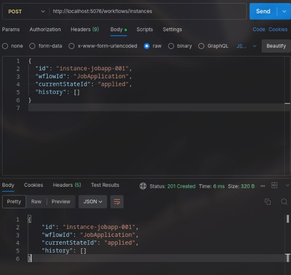
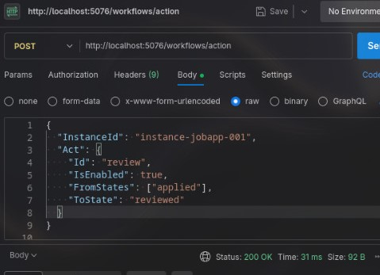
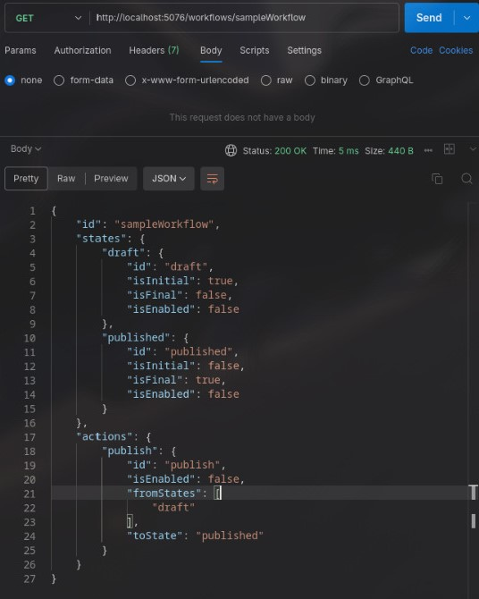
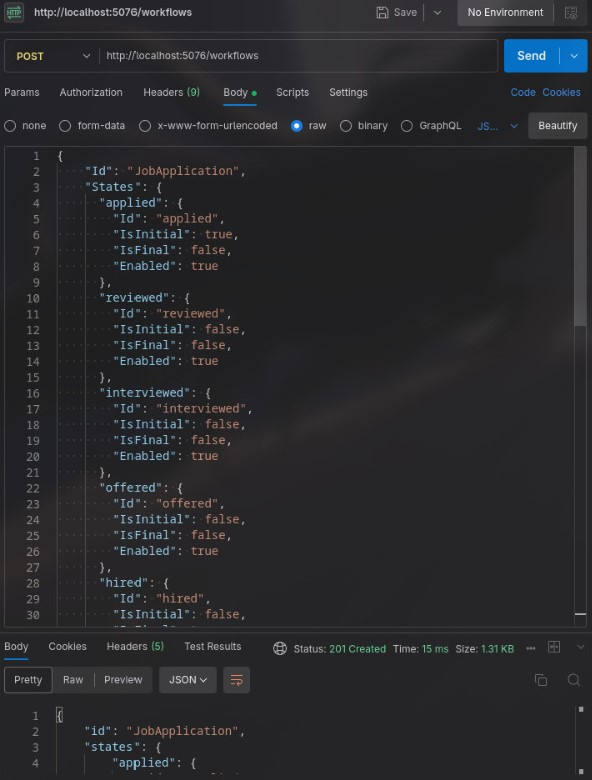

# Infonetica-Task
This repository is the implementation of state-machine API

## Feautures

- Define one or more configurable workflows (states + actions)
- Start workflow instances from predefined workflows
- Execute actions to transition instances with validation
- Inspect and list definitions, states, actions, and instances 

## API Endpoints
| Method | Endpoint                                 | Description                       |
|--------|------------------------------------------|-----------------------------------|
| POST   | `/workflows`                             | Create a new workflow definition  |
| GET    | `/workflows/{id}`                        | Retrieve a workflow definition    |
| POST   | `/workflows/instances`                   | Start a new workflow instance     |
| POST   | `/workflows/action`                      | Execute an action/transition      |
| GET    | `/workflows/instances/{id}`              | Retrieve  workflow instance by ID |

### Usage

- /workflows

- /workflows/{id}

- /workflows/instances

- /workflows/action
